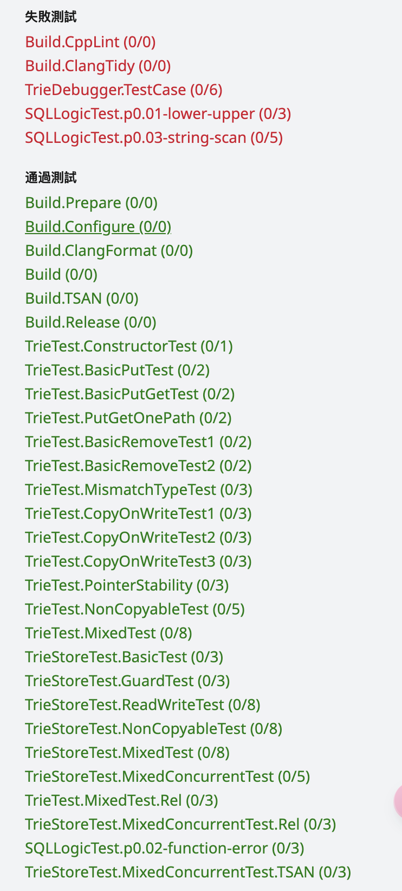

# [cow-trie](https://15445.courses.cs.cmu.edu/spring2023/project0/)

[trie](https://zh.wikipedia.org/wiki/Trie#:~:text=%E5%9C%A8%20%E8%AE%A1%E7%AE%97%E6%9C%BA%E7%A7%91%E5%AD%A6%20%E4%B8%AD%EF%BC%8C%20trie%20%EF%BC%8C%E5%8F%88%E7%A7%B0%20%E5%89%8D%E7%BC%80%E6%A0%91%20%E6%88%96%20%E5%AD%97%E5%85%B8%E6%A8%B9,%EF%BC%8C%E7%94%A8%E4%BA%8E%E4%BF%9D%E5%AD%98%20%E5%85%B3%E8%81%94%E6%95%B0%E7%BB%84%20%EF%BC%8C%E5%85%B6%E4%B8%AD%E7%9A%84%E9%94%AE%E9%80%9A%E5%B8%B8%E6%98%AF%20%E5%AD%97%E7%AC%A6%E4%B8%B2%20%E3%80%82%20%E4%B8%8E%20%E4%BA%8C%E5%8F%89%E6%9F%A5%E6%89%BE%E6%A0%91%20%E4%B8%8D%E5%90%8C%EF%BC%8C%E9%94%AE%E4%B8%8D%E6%98%AF%E7%9B%B4%E6%8E%A5%E4%BF%9D%E5%AD%98%E5%9C%A8%E8%8A%82%E7%82%B9%E4%B8%AD%EF%BC%8C%E8%80%8C%E6%98%AF%E7%94%B1%E8%8A%82%E7%82%B9%E5%9C%A8%E6%A0%91%E4%B8%AD%E7%9A%84%E4%BD%8D%E7%BD%AE%E5%86%B3%E5%AE%9A%E3%80%82)
，又称前缀树或字典树，是一种有序树，用于保存关联数组，其中的键通常是字符串。与二叉查找树不同，键不是直接保存在节点中，而是由节点在树中的位置决定。一个节点的所有子孙都有相同的前缀，也就是这个节点对应的字符串，而根节点对应空字符串。一般情况下，不是所有的节点都有对应的值，只有叶子节点和部分内部节点所对应的键才有相关的值。

键不需要被显式地保存在节点中。图示中标注出完整的单词，只是为了演示trie的原理。

trie中的键通常是字符串，但也可以是其它的结构。trie的算法可以很容易地修改为处理其它结构的有序序列，比如一串数字或者形状的排列。


## GET

因此要完成get操作只需便利树直到叶子节点，判断是否有值，如果是带值的叶子节点，则使用`dynamic_cast`将其转变为`const TrieNodeWithValue<T> *`类型，然后取出其值并返回。

```cpp
template <class T>
auto Trie::Get(std::string_view key) const -> const T * {
  if (!root_) return nullptr;

  auto root = root_;
  for (const char k : key) {
    if (root->children_.count(k)) {
      root = root->children_.at(k);
    } else {
      return nullptr;
    }
  }

  auto node = dynamic_cast<const TrieNodeWithValue<T> *>(root.get());
  if (!node) return nullptr;
  return root->is_value_node_ ? node->value_.get() : nullptr;
}
```

## PUT

要完成put操作。因为要支持并发控制，因此不能直接向原有的树中添加值，而要实现[cow](https://zh.wikipedia.org/wiki/%E5%AF%AB%E5%85%A5%E6%99%82%E8%A4%87%E8%A3%BD)，即写时复制操作。具体来说就是要复制一个新节点将新值写入后生成一颗心的前缀树，然后用它替代原有的树，
这样在一个线程读取的时候，其他线程也可以读取，也可以写入而不会造成crash。但是在一个线程写入时，其他线程是不能写的，因为两个一起写入势必会造成写后丢失的情况。


要完成put操作。我们首先复制根节点到new_root，然后只需要在new_root上操作即可。

1. 首先检查根节点是否为空，如果为空我们需要新生成一个根节点，否则clone原有的根节点。
2. 接着遍历trie，如果有对应的节点就clone原节点，否则就new一个新节点，让父结点指向其子结点，直到遍历完整个字符串，我们也构造出了新的trie。期间我们要保存叶子节点的父结点parent，以免再次查找。
3. 然后构造叶子节点，完成后让parent指向叶子结点。

```cpp
template <class T>
auto Trie::Put(std::string_view key, T value) const -> Trie {
  shared_ptr<TrieNode> root;
  if (!root_)
    root = make_shared<TrieNode>();
  else
    root = shared_ptr<TrieNode>(root_->Clone());

  auto new_root = root;
  shared_ptr<TrieNode> parent;
  for (const char k : key) {
    parent = root;
    if (root->children_.count(k)) {
      auto tmp = shared_ptr<TrieNode>(root->children_[k]->Clone());
      root->children_[k] = tmp;
      root = tmp;
    } else {
      auto tmp = make_shared<TrieNode>();
      root->children_[k] = tmp;
      root = tmp;
    }
  }
  auto leave = std::make_shared<TrieNodeWithValue<T>>(root->children_, std::make_shared<T>(std::move(value)));
  leave->is_value_node_ = true;
  if (key.empty()) return Trie(leave);

  parent->children_[key[key.size() - 1]] = leave;
  return Trie(new_root);
}

```

## REMOVE

remove是难度最高的一个操作，为了简单，我选择递归的进行remove操作。这样可以不用自己保存遍历时的记录。

首先还是复制原root_到new_root，然后在new_root上执行操作。

遍历到叶子节点然后将其is_value_node_赋值为false，然后就可以递归的进行删除，注意删除时要从叶子节点向根节点进行删除，因此我们使用递归实现倒序的删除，利用辅助函数`RemoveHelper`即可。

```cpp

auto Trie::Remove(std::string_view key) const -> Trie {
  auto root = shared_ptr<TrieNode>(root_->Clone());
  auto new_root = root;

  for (const char k : key) {
    auto temp = std::shared_ptr<TrieNode>(root->children_[k]->Clone());
    root->children_[k] = temp;
    root = temp;
  }
  root->is_value_node_ = false;

  if (RemoveHelper(key, 0, new_root)) {
    new_root = nullptr;
  }
  return Trie(new_root);
}

auto Trie::RemoveHelper(std::string_view key, size_t index, const std::shared_ptr<TrieNode> &root) const -> bool {
  if (index == key.length()) {
    return root->children_.empty();
  }
  if (RemoveHelper(key, index + 1, const_pointer_cast<TrieNode>(root->children_[key[index]]))) {
    root->children_.erase(key[index]);
  }
  return (!root->is_value_node_ && root->children_.empty());
}
```

这里就大体完成了全部操作，但是测试是无法通过的，最后在clone `TrieNodeWithValue`结点时，要生成一个临时的结点，而不能返回原有的指针，即可

```cpp
template <class T>
class TrieNodeWithValue : public TrieNode {
 public:
  auto Clone() const -> std::unique_ptr<TrieNode> override {
    //    return std::make_unique<TrieNodeWithValue<T>>(children_, value_);
    auto temp = std::make_unique<TrieNodeWithValue<T>>(children_, value_);
    temp->is_value_node_ = this->is_value_node_;
    return temp;
  }
  // The value associated with this trie node.
  std::shared_ptr<T> value_;
};

```


## Concurrency Control

这里要我们使用读写锁实现并发控制

* 读者在读trie时，其他的读者也可以读，其他的写者可以利用cow向树中写。
* 写者在写trie时，其他的写者要阻塞，其他的读者可以在原有的树中读取内容。


因此我们只需要使用两把锁，一把时将写者之间隔离开，使其互斥操作，另一把则是使得不同线程之间互斥访问root_结点，以防在一个线程读根节点时，另一个线程对其修改。

#### get

```cpp

template <class T>
auto TrieStore::Get(std::string_view key) -> std::optional<ValueGuard<T>> {
  unique_lock<mutex> lock(root_lock_);
  auto root = root_;
  lock.unlock();

  const T *ret = root.Get<T>(key);
  if (ret == nullptr)
    return std::nullopt;
  else
    return ValueGuard<T>(root, *ret);
}
```

#### put
```cpp

template <class T>
void TrieStore::Put(std::string_view key, T value) {
  lock_guard<mutex> lock(write_lock_);
  unique_lock<mutex> locker(root_lock_);
  auto root = root_;
  locker.unlock();
  auto ret = root.Put<T>(key, std::move(value));
  locker.lock();
  root_ = ret;
  locker.unlock();
}
```


#### remove

```cpp

void TrieStore::Remove(std::string_view key) {
  lock_guard<mutex> lock(write_lock_);
  unique_lock<mutex> locker(root_lock_);
  auto root = root_;
  locker.unlock();
  auto ret = root.Remove(key);
  locker.lock();
  root_ = ret;
  locker.unlock();
}
```

综上就完成了全部操作。


